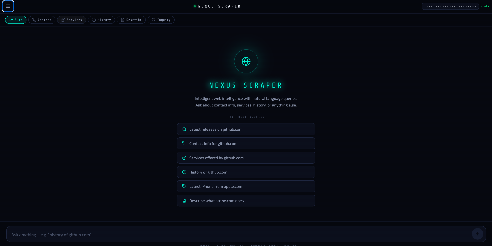
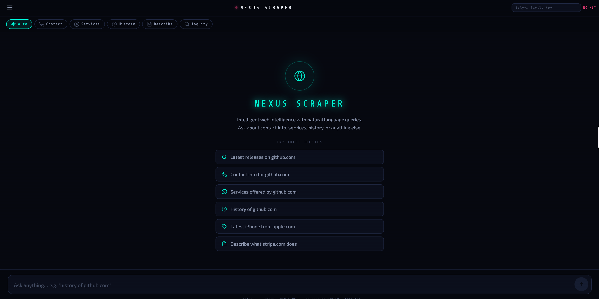

# Nexus-Web-Scrapper — Built App Snippets

Intelligent full-stack web scraper with natural-language chat interface, React Native/Expo frontend, and Python FastAPI backend.

Note: The execution container could not clone GitHub directly, so these are representative built-state screenshots recreated from the public repository source and README rather than a live local build.

## Included screenshots

## Source basis

Public README and frontend source describe a 3-panel web layout with history sidebar, chat interface, live preview, intent chips, session persistence, and ResultsCard output for contact/services/history/description/inquiry modes.
